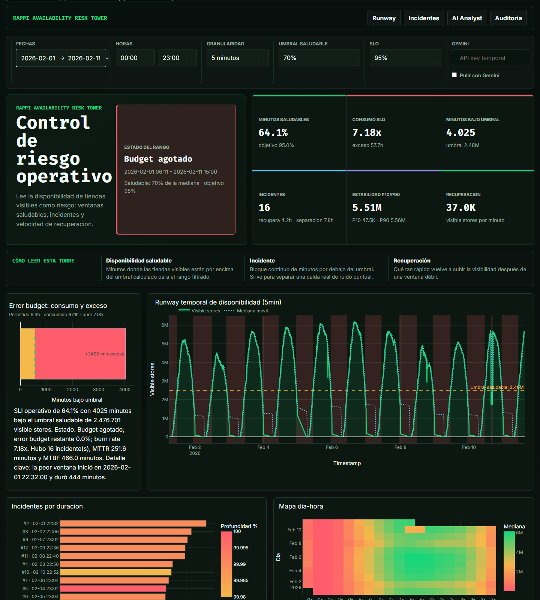

# Rappi Availability Risk Tower

Aplicacion local para la prueba tecnica **AI Interns 2026 de Rappi**. Transforma datos historicos de tiendas visibles en una torre de control de riesgo operativo: muestra cuando la disponibilidad esta saludable, cuando entra en incidente, cuanto consume del objetivo SLO y que tan rapido se recupera.



## Que problema resuelve

Un dashboard tradicional de disponibilidad suele responder solo: "cuantas tiendas estaban visibles". Esta aplicacion responde preguntas mas utiles para una operacion:

- En que momentos la disponibilidad estuvo bajo un umbral saludable.
- Cuantos minutos estuvieron en riesgo.
- Cuantos incidentes continuos ocurrieron.
- Que ventana fue la peor.
- Que tan rapido se recupero la disponibilidad.
- Si el rango filtrado cumple o no un objetivo operativo tipo SLO.

La narrativa principal es: **no solo se observa disponibilidad; se explica riesgo, consumo de budget e impacto operativo**.

## Tecnologias usadas

- **Python 3.11+**: lenguaje principal para analisis, transformacion de datos y servidor local.
- **Dash 4.1.0**: interfaz web interactiva con callbacks, filtros, tablas y graficos.
- **Pandas 2.2.3**: limpieza, agregacion temporal, resampling y calculo de metricas.
- **Plotly 5.24.1**: visualizaciones interactivas de timeline, heatmap, distribucion e incidentes.
- **Gemini Flash**: capa opcional para redactar briefing y respuestas de chat con mejor lenguaje.
- **Pytest**: pruebas de carga, metricas, modelo de riesgo y chatbot.

Se conserva Python porque permite entregar una solucion reproducible y facil de evaluar sin introducir una arquitectura innecesariamente grande.

## Que hace la aplicacion

La app carga `data/processed/availability_long.csv`, una serie temporal agregada con la metrica `synthetic_monitoring_visible_stores`. Cada punto representa la cantidad de tiendas visibles en un momento.

Sobre esos datos calcula:

- **Disponibilidad saludable**: porcentaje de minutos donde `visible_stores` esta por encima del umbral saludable.
- **Umbral saludable**: por defecto, `70%` de la mediana del rango filtrado.
- **Objetivo SLO**: por defecto, `95%` de minutos saludables.
- **Incidente**: bloque continuo de minutos bajo el umbral saludable.
- **Error budget**: margen permitido de minutos no saludables segun el SLO.
- **Burn rate**: cuantas veces se consumio el budget permitido.
- **MTTR**: tiempo medio de recuperacion de incidentes.
- **MTBF**: separacion media entre incidentes.
- **P10/P50/P90**: percentiles para leer estabilidad y dispersion.
- **Velocidad de recuperacion**: cambio aproximado de tiendas visibles por minuto al salir de incidentes.

## Como leer la interfaz

- **Panel superior**: filtros de fecha, hora, granularidad, umbral saludable, objetivo SLO y Gemini.
- **Control de riesgo operativo**: estado ejecutivo del rango seleccionado.
- **Metricas principales**: resumen de salud, consumo SLO, minutos bajo umbral, incidentes, estabilidad y recuperacion.
- **Error budget**: compara minutos permitidos por el SLO contra minutos realmente consumidos.
- **Runway temporal**: serie de tiendas visibles, umbral saludable, mediana movil y franjas de incidentes.
- **Incidentes por duracion**: ranking de ventanas debiles.
- **Mapa dia-hora**: patron horario de disponibilidad.
- **Distribucion P10/P50/P90**: estabilidad de la serie.
- **Tablas auditables**: incidentes y puntos recientes, con exportacion CSV.
- **AI Analyst**: preguntas en lenguaje natural sobre el rango filtrado.

## Instalacion local

En PowerShell, desde la carpeta del proyecto:

```powershell
python -m venv .venv
.\.venv\Scripts\python -m pip install --upgrade pip
.\.venv\Scripts\python -m pip install -r requirements.txt
```

El dataset procesado ya viene incluido para que el evaluador pueda correr la app directamente. Si se quiere reconstruir desde los CSV originales:

```powershell
.\.venv\Scripts\python scripts\build_dataset.py --input "Archivo (1)" --output data\processed\availability_long.csv
```

## Configurar Gemini

La app funciona sin Gemini usando respuestas deterministicas basadas en los datos calculados localmente. Gemini solo mejora la redaccion del briefing y del chat; no inventa metricas nuevas.

Opcion recomendada:

```powershell
Copy-Item .env.example .env
notepad .env
```

En `.env`, reemplazar:

```txt
GEMINI_API_KEY=replace_me
```

por una clave real de Gemini.

Tambien se puede configurar solo para la sesion:

```powershell
$env:GEMINI_API_KEY="tu_api_key"
```

Si hay clave en `.env` o en variables de entorno, la app activa automaticamente `Pulir con Gemini`. Si no hay clave, la demo sigue funcionando.

## Ejecutar

```powershell
.\.venv\Scripts\python app.py
```

Abrir:

```txt
http://127.0.0.1:8050
```

## Preguntas sugeridas para la demo

```txt
¿Cuál fue el peor incidente?
¿Cómo está el SLO y el error budget?
Resume el riesgo operativo del rango.
¿Qué día tuvo mejor mediana?
¿Cuáles fueron los cambios más fuertes?
```

## Verificacion

```powershell
.\.venv\Scripts\python -m pytest -q
.\.venv\Scripts\python -m py_compile app.py src\rappi_availability\*.py scripts\build_dataset.py
```

## Estructura del proyecto

```txt
app.py                                  # App Dash principal
assets/risk_tower.css                   # Sistema visual de la interfaz
data/processed/availability_long.csv    # Dataset procesado incluido para demo
scripts/build_dataset.py                # Normalizacion de CSV originales
src/rappi_availability/load_data.py     # Carga y limpieza de datos
src/rappi_availability/metrics.py       # KPIs descriptivos
src/rappi_availability/risk_model.py    # SLO, incidentes y error budget
src/rappi_availability/semantic_chat.py # Chat y Gemini
tests/                                  # Pruebas unitarias
docs/assets/                            # Capturas para README
```

## Limitaciones y decisiones

- Los datos son agregados de tiendas visibles; no hay IDs de tiendas individuales.
- El SLO es un objetivo operativo derivado para analisis, no un SLA real de Rappi.
- El umbral saludable por defecto usa la mediana del rango filtrado para adaptarse al nivel historico observado.
- El chatbot esta grounded: primero calcula respuestas con Pandas y despues Gemini solo redacta si esta habilitado.
- No se versionan API keys reales. `.env` esta ignorado por Git y `.env.example` solo trae un placeholder.

## Resultado esperado

El evaluador puede clonar el repositorio, instalar dependencias, ejecutar la app y entender rapidamente:

1. Que datos se usan.
2. Que metricas se calculan.
3. Que significa cada grafico.
4. Como Gemini aporta sin reemplazar los calculos locales.
5. Como verificar que la solucion funciona.
